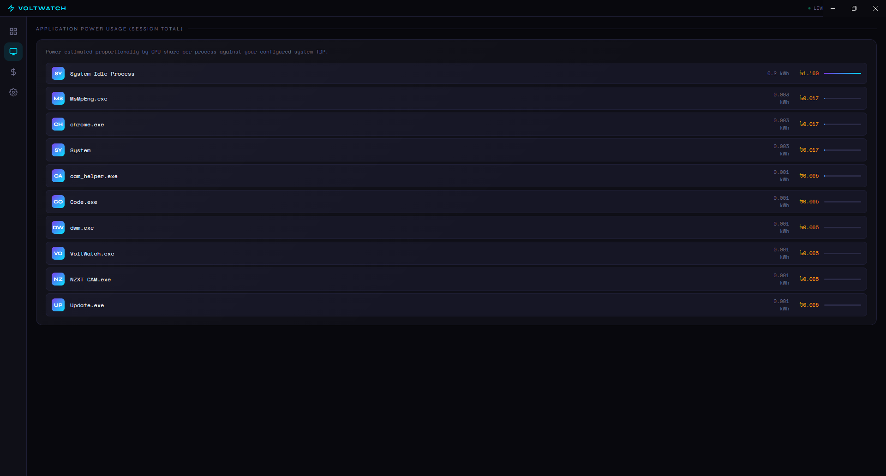
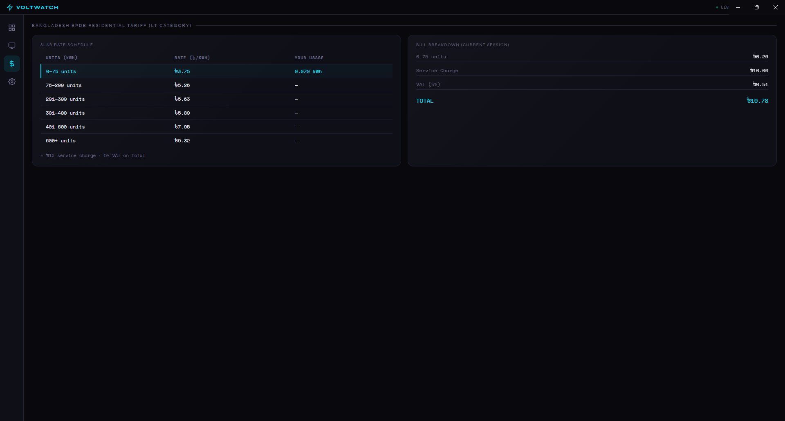
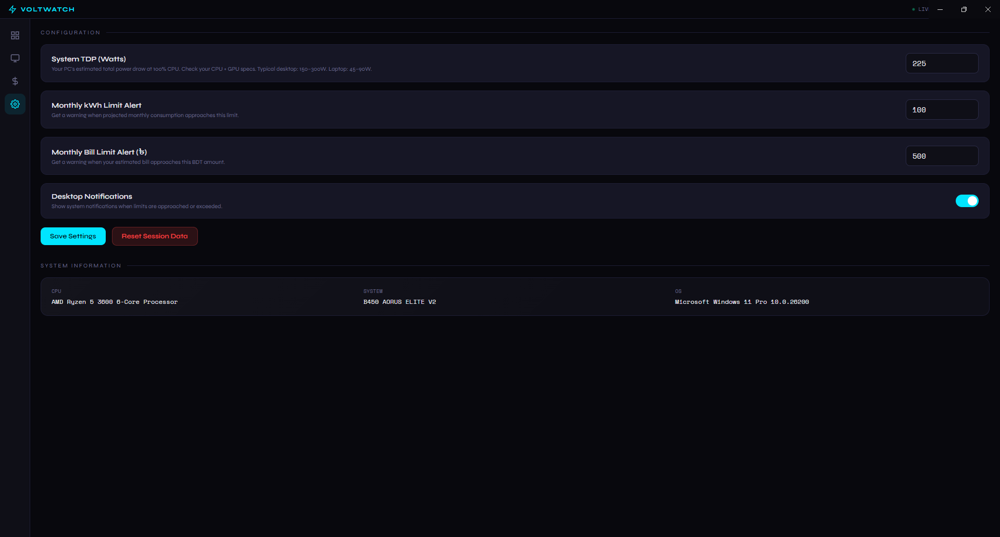

# ⚡ VoltWatch


VoltWatch is a real-time PC electricity bill monitor that runs in the background and estimates how much electricity your PC is consuming in real time. It then calculates your bill using the official **BPDB residential slab rates** — the same rates on your actual electricity bill. You get live graphs, per-app breakdowns, and warnings before you exceed your limit. 

- **Live power draw** — Estimated from your CPU load against your system TDP
- **Real-time bill** — BPDB slab rates with VAT, updated every 3 seconds
- **Per-app usage** — See which apps are costing you the most electricity
- **24-hour chart** — Hourly bar graph of energy consumed
- **Live watt trend** — Real-time line graph of power draw
- **Bill & kWh limits** — Set a limit and get a desktop notification when you're close
- **Monthly projection** — Estimates your full monthly bill from current session data
- **Full tariff breakdown** — Shows exactly which BPDB slab you're currently in

Click [here](#prerequisites) to head to the installation section.

---

## Visuals
### Dashboard


### App Usage




### Tariff Tab


---

## Getting Started

### Prerequisites

- **Windows 10/11** (64-bit)
- **Node.js** (LTS) — [nodejs.org](https://nodejs.org) — skip if already installed

Verify Node.js is installed:
```
node --version
```
Should return something like `v20.x.x`.

---

### Installation

**1. Extract the project**

Download the files to any drive with at least 500MB free space.

**2. Open Command Prompt inside the folder**

In File Explorer, navigate into the `voltwatch` folder, click the address bar, type `cmd`, and press Enter.

**3. Install dependencies**
```
npm install
```
This downloads Electron and required packages into a local `node_modules` folder (~400MB). Only needed once.

**4. Run the app**
```
npm start
```
VoltWatch opens as a desktop window. Done!

---

### Build the .exe

Once you've tested the app and are happy with it, build a proper Windows executable:

> ⚠️ Run Command Prompt **as Administrator** for the build step (right-click CMD → Run as administrator), then navigate to your folder:
> ```
> cd /d G:\your\path\to\voltwatch
> ```
> The `/d` flag is required when switching drives (e.g. from C to G).

```
npm run build
```

Two files will be created in the `dist/` folder:

| File | Description |
|------|-------------|
| `VoltWatch Setup 1.0.0.exe` | Installer — adds a Start Menu shortcut |
| `VoltWatch 1.0.0.exe` | Portable — runs directly, no installation |

Use the **portable version** to test first, then run the installer if you want it properly set up.

---

## Configuration

Open the app and go to **Settings** (gear icon in the sidebar).



| Setting | Description |
|---------|-------------|
| **System TDP (Watts)** | Your PC's estimated total power draw. This is the most important setting for accuracy — see below. |
| **Monthly kWh Limit** | Get an alert when projected usage approaches this amount |
| **Monthly Bill Limit (৳)** | Get an alert when your estimated bill nears this BDT amount |
| **Notifications** | Toggle desktop popup alerts on/off |

### Finding Your TDP

1. Press `Win + R`, type `dxdiag`, press Enter
2. Note your **CPU name** (e.g. Intel Core i5-12400)
3. Go to the **Display** tab — note your **GPU name** if you have one
4. Google each: `[CPU name] TDP` and `[GPU name] TDP`
5. Add them together — that's your system TDP

**Quick estimates:**

| PC Type | TDP to set |
|---------|------------|
| Basic laptop | 65W |
| Mid-range laptop | 90W |
| Desktop, no dedicated GPU | 100–120W |
| Desktop with mid-range GPU | 180–220W |
| Gaming PC with high-end GPU | 300W+ |

---

## Bangladesh BPDB Tariff (Residential LT, 2024)

| Slab | Units | Rate |
|------|-------|------|
| 1 | 0 – 75 kWh | ৳ 3.75 / kWh |
| 2 | 76 – 200 kWh | ৳ 5.26 / kWh |
| 3 | 201 – 300 kWh | ৳ 5.63 / kWh |
| 4 | 301 – 400 kWh | ৳ 5.89 / kWh |
| 5 | 401 – 600 kWh | ৳ 7.95 / kWh |
| 6 | 600+ kWh | ৳ 9.32 / kWh |

Plus ৳10 service charge and 5% VAT on the total.

The app shows a full line-by-line breakdown of your bill on the **Tariff** page.

---

## How Power Is Estimated

VoltWatch cannot read your physical power meter, but it estimates based on real CPU load:

```
Estimated Watts = Idle Power + (CPU Load% × (TDP − Idle Power))
Idle Power = 20% of your configured TDP
```

The more accurately you set your TDP in Settings, the more accurate your bill calculation will be.

## How Data Is Fetched

VoltWatch uses a package called [`systeminformation`](https://systeminformation.io) which talks directly to **Windows Management Instrumentation (WMI)** — the same underlying system that powers Task Manager. Here's exactly what happens every 3 seconds:

### CPU Load
```js
si.currentLoad()
```
Reads the real-time CPU usage percentage across all cores, averaged into one number. This is identical to what you see in Task Manager → Performance tab.

### Per-App Process List
```js
si.processes()
```
Fetches every running process with its name, CPU%, and RAM usage — identical to Task Manager → Details tab. VoltWatch sorts by CPU% and displays the top apps.

---

## Security

VoltWatch is built following Electron security best practices:

- `contextIsolation: true` — renderer is isolated from Node.js
- `nodeIntegration: false` — no direct Node access in the UI
- Preload script used — only specific, safe functions are exposed to the UI
- No network calls — all data stays on your machine, nothing is sent anywhere

You may see a **Windows SmartScreen warning** the first time you run the `.exe` — this is because the app is unsigned (code signing certificates cost money). Click **"More info" → "Run anyway"** to proceed. You can read every line of the source code in the `src/` folder to verify nothing suspicious is happening.

---

## Updating

To update Electron (and its bundled Chromium) in the future:

```
npm update
npm run build
```

For a personal local-use app like this, once a year is more than enough. The security risk from an outdated Electron is minimal since VoltWatch loads no external websites and receives no data from the internet.

---

## Project Structure

```
voltwatch/
├── src/
│   ├── main.js         ← Main process: system monitoring, bill calculation, IPC
│   ├── preload.js      ← Secure bridge between main process and UI
│   └── index.html      ← Full UI: dashboard, charts, app usage, settings
├── assets/             ← App icons
├── dist/               ← Built .exe files (created after npm run build)
├── node_modules/       ← Dependencies (created after npm install)
├── package.json        ← Project config and build settings
└── README.md           ← This file
```

---

## Troubleshooting

**Build fails with "Cannot create symbolic link"**
Run Command Prompt as Administrator (right-click → Run as administrator).

**App shows 0W power draw**
The `systeminformation` package may not have loaded yet. Wait a few seconds or restart the app.

**Windows SmartScreen blocks the .exe**
Click "More info" → "Run anyway". This happens because the app is unsigned.

**Antivirus flags the app**
Electron apps that read system process info can trigger false positives. Add the app folder to your antivirus whitelist (e.g. in Comodo: Security → Exceptions).

**Bill seems too high or too low**
Go to Settings and adjust your System TDP to more accurately reflect your hardware.

---

Built with [Electron](https://electronjs.org) · [Chart.js](https://chartjs.org) · [systeminformation](https://systeminformation.io)
